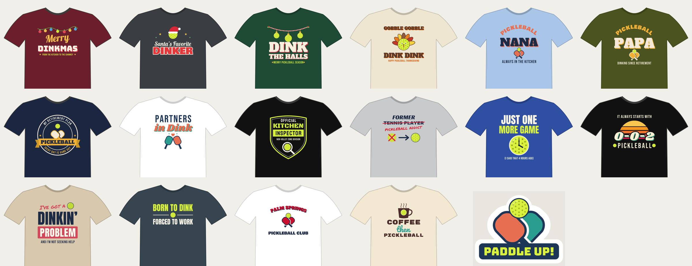

# bagoflean: an AI design agent for Etsy

An agent that comes up with, draws, checks, and writes listings for
print-on-demand t-shirt designs, aimed at the niche it was built for:
**pickleball apparel and gifts.**



## Why pickleball

- **Huge and still growing.** SFIA's 2026 report counts about **24.3 million US
  players in 2025, up 22.8% in a year and 171.8% over three years**. That makes
  it the fastest-growing US sport three years running, with about 4.5M new
  players a year. Each new player is a new merch buyer.
- **Buyers with money who shop for gifts.** Players skew older (retirees, empty
  nesters), and their kids and grandkids keep searching "pickleball gift for
  grandpa". Gift searches convert better than any other kind of Etsy traffic.
- **Insider language.** Dink, the kitchen, 0-0-2, erne, banger. Jokes that make
  a core player feel seen are hard for generic shops to copy.
- **Bulk orders.** Clubs and leagues buy matching shirts.
- **A good fit for the agent.** Typography-led designs with simple icons
  (paddles, balls, nets) are exactly what an AI can draw as crisp vector art.

Sources: [SFIA participation report via pickleball.com](https://pickleball.com/news/sfia-report-confirms-over-24-million-americans-playing-pickleball),
[The Kitchen](https://thekitchenpickle.com/blogs/news/24-3-million-americans-played-pickleball-in-2025-sfia-report-says/),
[Gelato on gifting niches](https://www.gelato.com/blog/profitable-niches).

## What the agent does

```
 (optional) web research ─▶ strategist ─▶ designer ⇄ measure_text tool
     current trends,         concepts:       writes SVG artwork
     upcoming holidays       slogan, buyer,       │
                             occasion, colours    ▼
                                            render 4500x5400 PNG + shirt mockup
                                                  │
                             art director ◀───────┘   (vision review, score 1-10,
                                  │                    + automatic spelling, size
                       score < 8? ┴─▶ back to designer with notes (up to 3 rounds)
                                  │
                                  ▼
                             copywriter ─▶ Etsy title, 13 tags, description
```

Every finished design gets its own folder in `output/<design-name>/`:

| File | What it is |
|---|---|
| `design.png` | Print file: 4500x5400 px, 300 DPI, transparent background (Printify/Printful front-print size) |
| `design.svg` | Editable vector source |
| `mockup.png` | Preview on the chosen shirt colour |
| `listing.md` | Title, tags, description and alt text, ready to paste into Etsy |
| `listing.json`, `concept.json`, `review.json` | The same data as JSON, plus the art director's review |

Built-in safety rails:
- Blocks protected names (paddle brands, pro tours, pro players, rating
  systems, famous characters) in slogans, artwork and listings.
- Checks that every word of the slogan really appears in the artwork, so you
  don't ship a typo.
- Checks Etsy's limits (140-character title, exactly 13 tags of at most 20
  characters each) and fixes the listing automatically if needed.
- Adds an AI-use and production-partner disclosure line to every description.
- Remembers designs it already made so new batches don't repeat jokes.

## Ready-made designs (17)

Seventeen finished designs with print files and ready-to-paste listings are in
[`samples/`](samples/). Upload them in this order. The holiday ones are time-sensitive,
because Etsy needs a few weeks to rank new listings.

| # | Design | Product / colour | Why |
|---|---|---|---|
| 1 | [Gobble Gobble, Dink Dink](samples/gobble-gobble-dink-dink/listing.md) | Tee, Natural | Thanksgiving. List this week |
| 2 | [Merry Dinkmas](samples/merry-dinkmas/listing.md) | Sweatshirt, Maroon | Christmas |
| 3 | [Dink the Halls](samples/dink-the-halls/listing.md) | Sweatshirt/tee, Forest Green | Christmas |
| 4 | [Santa's Favorite Dinker](samples/santas-favorite-dinker/listing.md) | Tee, Dark Heather | Christmas, kids and family |
| 5 | [Pickleball Nana](samples/pickleball-nana/listing.md) | Tee, Light Blue | Grandma gift |
| 6 | [Pickleball Papa](samples/pickleball-papa/listing.md) | Tee, Military Green | Grandpa gift |
| 7 | [My Retirement Plan: Pickleball](samples/retirement-plan-pickleball/listing.md) | Tee, Navy | Retirement gift |
| 8 | [Coffee, then Pickleball](samples/coffee-then-pickleball/listing.md) | **Mug** (`mug-11oz.png`) + tee | Cheap, easy gift |
| 9 | [Paddle Up! sticker](samples/paddle-up-sticker/listing.md) | **Sticker** | Stocking stuffer |
| 10 | [Partners in Dink](samples/partners-in-dink/listing.md) | Tee, White | Couples (sells in pairs) |
| 11 | [Kitchen Inspector](samples/kitchen-inspector/listing.md) | Tee, Black | Insider joke |
| 12 | [Just One More Game](samples/just-one-more-game/listing.md) | Tee, True Royal | Obsession humor |
| 13 | [I've got a Dinkin' Problem](samples/dinkin-problem/listing.md) | Tee, Sand | Obsession humor |
| 14 | [It always starts with 0-0-2](samples/zero-zero-two/listing.md) | Tee, Black | Insider joke, retro |
| 15 | [Former Tennis Player](samples/former-tennis-player/listing.md) | Tee, Athletic Heather | Players who switched from tennis |
| 16 | [Born to Dink, Forced to Work](samples/born-to-dink-forced-to-work/listing.md) | Tee, Charcoal | Working-age players |
| 17 | [*Your Town* Pickleball Club](samples/pickleball-club-personalized/listing.md) | Personalised tee, White | Clubs and teams |

Put each design on 2-3 products (tee, sweatshirt, hoodie, mug) and you'll have 40+ listings.

### Personalised club shirts
When someone orders the club shirt, make their print file with:

```bash
python scripts/club_shirt.py "Lake Havasu City"   # -> output/club-lake-havasu-city/design.png
```

## Setup

You need Python 3.10+, the Cairo graphics library, and an Anthropic API key.

```bash
# Cairo (used to turn the artwork into PNGs)
#   macOS:          brew install cairo
#   Ubuntu/Debian:  sudo apt install libcairo2
#   Windows:        easiest via WSL (Ubuntu), then the line above

pip install -r requirements.txt
export ANTHROPIC_API_KEY=sk-ant-...      # from console.anthropic.com
```

## Usage

```bash
# 1. Brainstorm cheaply first: get 10 ideas and pick the ones you like
python -m etsy_agent ideas --count 10 --research
python -m etsy_agent ideas --count 8 --focus "Christmas gifts for grandparents"

# 2. Turn picked ideas into finished designs + listings
python -m etsy_agent make --ideas output/ideas-20261004-120000.json --pick 1,3,7

# ...or do it all in one go
python -m etsy_agent make --count 3 --research

# Tweak a design.svg by hand (any text editor or Inkscape), then re-render it (no API needed)
python -m etsy_agent render output/dink-the-halls/design.svg --shirt "#1F4A33"
```

Useful options for `make`: `--rounds 3` (maximum review/revise rounds), `--jobs 2` (work on
designs in parallel), `--focus "..."` (steer the batch). `--research` lets the
agent search the web for current trends and upcoming holidays before
brainstorming.

Each run prints its token usage and estimated cost. Start with `--count 1` to see
what one design costs you. Set `ETSY_AGENT_MODEL` to use a different Claude model.

## From design to Etsy listing

1. Connect a print-on-demand provider such as Printify or Printful to your Etsy shop.
2. Create a product (popular blanks: Bella+Canvas 3001 tee, Gildan 18000 sweatshirt),
   upload `design.png`, and choose the shirt colour named in `listing.md`.
3. Use the provider's photo mockups as your listing images.
4. Paste the title, tags and description from `listing.md`, and fill in the `[BRACKETED]`
   product details.
5. **Before publishing:** search the slogan on the
   [USPTO trademark search](https://tmsearch.uspto.gov) and on Etsy. The agent avoids
   known brands, but it can't promise that a phrase isn't trademarked.
6. In the listing settings, name your production partner and keep the AI disclosure
   line. Etsy requires both for print-on-demand items made with AI tools.

Timing matters more than anything else: get holiday designs listed 6-8 weeks before the
holiday. Mother's Day, Father's Day and Christmas are the big pickleball gift spikes.

## Changing the niche

All the niche knowledge lives in [`etsy_agent/niche.py`](etsy_agent/niche.py): buyer
types, vocabulary, joke angles, styles, occasions and blocked names. To point the agent
at another niche, write another `NicheProfile` and pass it to `DesignAgent(niche=...)`.

## Development

```bash
python tests/test_pipeline.py     # offline: runs the full agent loop against a fake API
```

Fonts in [`fonts/`](fonts/) are from Google Fonts (SIL Open Font License / Apache 2.0),
which allows commercial use on products.
